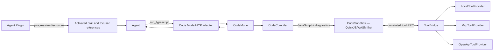

# CodeModeKit Architecture

**Status:** Working architecture; core decisions locked for the initial implementation  
**Date:** 2026-08-09  
**Scope:** TypeScript SDK for exposing large tool catalogs to agents through sandboxed code without placing every tool declaration in model context

## Purpose

This document captures the architecture developed during the research phase. It is intended to become the initial design brief for a future project repository.

The central idea is to give an agent one small Code Mode surface. The agent writes TypeScript that calls a namespaced `tools` API, and that code runs in a portable sandbox. Tool documentation is disclosed progressively through Agent Skills instead of loading the entire catalog into the prompt.

This is not intended to be a general integration-management platform. It is a focused, embeddable CodeModeKit with adapters for multiple sources of tools.

## Locked decisions

| Area | Decision |
|---|---|
| Language | TypeScript-first |
| MCP foundation | Build on [`modelcontextprotocol/typescript-sdk`](https://github.com/modelcontextprotocol/typescript-sdk) |
| Runtime baseline | Node.js 20+ and ESM |
| MCP SDK baseline | Exact-pinned split v2 packages; v0.1 may ship against `2.0.0-beta.5` |
| Protocol negotiation | Explicit automatic modern-to-legacy negotiation for upstream clients |
| Guaranteed MCP matrix | `2026-07-28`, legacy `2025-11-25`, stdio, Streamable HTTP, and legacy SSE client compatibility |
| Public facade | Batteries-included `codemodekit`; `CodeMode` remains the low-level expert facade |
| Compilation boundary | `CodeCompiler` |
| Isolation boundary | `CodeSandbox` |
| Sandbox-to-tool boundary | `ToolBridge` |
| Tool source abstraction | `ToolProvider` |
| Initial provider | Multiple `McpToolProvider` instances in one catalog |
| v0.1 provider proof | Private in-memory conformance provider plus one mixed-provider execution test |
| Provider API stability | Internal or explicitly experimental in v0.1; stabilize after real heterogeneous v2 implementations |
| Planned v2 providers | `LocalToolProvider` and `OpenApiToolProvider` alongside MCP sources |
| Tool API | Namespaced calls such as `tools.github.searchIssues(...)` |
| Initial sandbox | QuickJS/WASM |
| Additional sandboxes | Adapters later; do not couple the core to one runtime |
| Documentation and discovery | Agent Plugins and Agent Skills with progressive disclosure |
| Search | `search_tools` enabled by default as a bounded deterministic fallback; consumers may opt out |
| MCP exposure | A separate adapter around the core SDK |
| Protocol-native capabilities | MCP Apps, Tasks, and future Skills remain explicit sibling projections rather than behavior tunneled through sandbox tool results |
| MCP-native skills | Reserved future delivery mechanism; wait for formal MCP SDK support |

## Compatibility baseline

The MCP dependency is isolated behind `McpToolProvider` and the downstream registration adapter wherever practical. A published v0.1 release pins the exact MCP TypeScript SDK beta it passed conformance against instead of accepting a moving prerelease range. Upgrading to another beta or stable v2 is an intentional SDK change, not an invisible transitive update.

Managed upstream clients explicitly select automatic protocol negotiation: try the modern MCP era and fall back to legacy behavior. The contractual v0.1 matrix covers MCP `2026-07-28` over stdio and Streamable HTTP, legacy `2025-11-25`, and the legacy SSE client connection path. Older revisions supported incidentally by the pinned official SDK are best effort.

The downstream adapter registers Code Mode tools on a consumer-owned MCP v2 server. It does not own that server's lifecycle or promise a downstream transport such as legacy SSE. See ADR 0017.

## Public shape

The default server API hides the fixed v0.1 TypeScript compiler and QuickJS implementation while retaining explicit policy and source configuration:

```ts
await serveCodeModeStdio({
  name: "deployment-code-mode",
  version: "0.1.0",
  toolPolicy: allowAllToolCalls(),
  sources: [
    mcp.stdio({
      name: "deployment",
      command: "deployment-mcp",
    }),
  ],
});
```

`serveCodeModeHttp` hosts the same application over Streamable HTTP. `createCodeModeMcp` constructs the batteries-included application without selecting a downstream transport. The `create-codemodekit` package generates the stdio form from an MCP command.

The low-level expert API remains:

```ts
const codeMode = new CodeMode({
  compiler: new TypeScriptCompiler(),
  sandbox: new QuickJsSandbox(),
  toolPolicy: allowAllToolCalls(), // Explicit development/example choice.
  providers: [
    new McpToolProvider(...),
    new McpToolProvider(...),
  ],
});

const result = await codeMode.run({
  code,
  context,
  signal,
  onProgress,
});
```

The MCP surface is an adapter rather than the owner of the runtime:

```ts
registerCodeModeTools(server, {
  codeMode,
});

// Consumers with complete, maintained skills may opt out.
registerCodeModeTools(server, { codeMode, search: false });
```

The adapter composes with other tools and protocol extensions on a consumer-owned MCP server; it does not claim the whole server:

```ts
registerCodeModeTools(server, { codeMode });
registerConsumerTools(server);
registerConsumerApps(server);
```

These registrations may share underlying application services, but each projection owns its protocol contract. For example, a consumer-owned tool can be both available through a future `LocalToolProvider` and registered directly as an MCP App. The direct MCP tool can render its View; a nested call to the same capability through `run_typescript` remains a computation-only call.

The preferred model-facing surface is deliberately small:

- `run_typescript`
- `search_tools`, enabled by default as a fallback

`run_typescript` accepts a `code` string that is compiled as the body of an SDK-generated async entry function. Model-authored code can use top-level `await` and an explicit `return`; reaching the end produces `undefined`, and the final expression is not implicitly returned.

The exact API signatures remain implementation details until the first prototype, but the component boundaries and responsibilities are fixed. Local and OpenAPI providers join the same catalog in v2.

`CodeMode.run` resolves expected execution outcomes through a discriminated success/failure union. Compiler failures, sandbox failures, and uncaught tool failures are model-visible results rather than opaque thrown exceptions. The MCP adapter includes both a concise textual diagnostic and the bounded structured failure so an LLM can revise and retry its code.

Model-visible diagnostics use SDK-owned stable codes. Compiler and provider codes are retained only as secondary context, such as `compilerCode` or `tool.upstreamCode`, so upstream changes do not redefine the SDK contract. Existing SDK-code meanings remain stable within a major version; minor releases may add codes, and consumers must handle unknown future values. See ADR 0012.

`CodeMode.run` accepts one root `AbortSignal`. The downstream MCP adapter binds the active request's cancellation to that signal; the core propagates it to sandbox execution, the bridge queue, and active provider calls. Transport-specific MCP cancellation stays in the official SDK adapter. Caller cancellation, wall timeout, compute exhaustion, and per-tool timeout share cleanup machinery but retain distinct diagnostic codes.

Progress uses provider-independent lifecycle events. The MCP adapter emits them only when the downstream request supplies a progress token. Outer MCP progress is a monotonically increasing sequence with no invented total; upstream tool progress is sanitized into a bounded source-and-tool message rather than forwarding upstream tokens or numeric progress. See ADR 0014.

## Architecture



### `CodeMode`

`CodeMode` is the small orchestration facade. It coordinates compilation, sandbox execution, tool access, and result production.

It does not own MCP transport details and does not need to know how skills are distributed.

### `CodeCompiler`

`CodeCompiler` converts model-authored TypeScript into executable JavaScript and produces useful diagnostics.

The compiler owns the internal async wrapper and must translate diagnostics and source locations back to the consumer's unwrapped `code` string.


Keeping this separate from the sandbox provides:

- consistent behavior across QuickJS, Workers, subprocess, and hosted sandbox adapters;
- a stable location for syntax recovery, compilation, diagnostics, and source maps;
- freedom to change the compiler without changing the security boundary;
- the possibility of supporting additional input languages later without redefining `CodeSandbox`.

### `CodeSandbox`

`CodeSandbox` is the portable isolation boundary. QuickJS/WASM is the first implementation, but the interface must allow future adapters such as Cloudflare Workers, E2B, Daytona, or subprocess runtimes.

The sandbox receives executable JavaScript and a narrow tool-call bridge. It must not receive provider credentials, unrestricted network access, or ambient access to the host process.

Initial controls should include:

- execution timeout;
- memory and stack limits where the runtime supports them;
- cancellation;
- deterministic cleanup;
- bounded logs and output;
- no ambient `fetch`; external effects occur only through registered tools.

v0.1 supplies finite defaults rather than requiring every consumer to invent a security policy:

```ts
const defaultExecutionLimits = {
  sourceBytes: 128 * 1024,
  computeTimeMs: 5_000,
  wallTimeMs: 60_000,
  toolCallTimeMs: 30_000,
  memoryBytes: 64 * 1024 * 1024,
  maxToolCalls: 32,
  maxConcurrentToolCalls: 8,
  toolResultBytes: 2 * 1024 * 1024,
  totalBridgeBytes: 8 * 1024 * 1024,
  finalResultBytes: 256 * 1024,
  logBytes: 64 * 1024,
  logEntries: 100,
  progressMessageBytes: 1024,
  maxProgressEvents: 100,
  progressEventsPerSecond: 10,
} as const;
```

`computeTimeMs` counts time actively executing sandbox JavaScript and excludes suspension while awaiting host tools; `wallTimeMs` covers the complete run. Tool concurrency is queued at the configured cap. Logs retain bounded head and tail records plus an explicit truncation marker. Source, tool-result, bridge, and final-result limits fail explicitly rather than silently returning partial data. See ADR 0013.

The sandbox has no module system or package loader. Static imports, dynamic `import()`, `require`, host process globals, filesystem APIs, network APIs, and dynamic code-generation primitives such as `eval` and `Function` are absent or rejected. Model-authored code receives a versioned allowlist of portable JavaScript intrinsics, the `tools` proxy, and a bounded `console` implementation. The allowlist is part of sandbox conformance so adapters cannot accidentally expose runtime-specific capabilities.

### `ToolBridge`

`ToolBridge` turns calls made inside the sandbox into trusted host-side tool invocations.

For a call such as:

```ts
const issues = await tools.github.searchIssues({
  query: "is:open label:bug",
});
```

the bridge is responsible for:

1. resolving the namespaced tool address;
2. checking model visibility;
3. validating and bounding the input;
4. queueing under the execution concurrency limit;
5. obtaining an allow or deny decision from the required host-side tool policy;
6. dispatching to the correct provider only after an allow decision;
7. validating and bounding the result;
8. returning a correlated response to the sandbox;
9. carrying tracing, cancellation, and sanitized errors across the boundary.

`CodeMode` construction requires a tool policy. The SDK provides explicit helpers such as `allowAllToolCalls()` for examples and trusted environments, but there is no implicit allow-all default. A production policy may apply static rules or await an embedding application's own approval service. It runs outside the sandbox, receives validated arguments and untrusted upstream annotations as hints, and fails closed. v0.1 does not pause and replay `run_typescript` through MCP elicitation for a nested approval. See ADR 0016.

The name is intentionally concrete: whether a capability originates as a local function, an MCP tool, or an operation from an OpenAPI document, it is presented to sandboxed code as a tool.

### `ToolProvider`

`ToolProvider` normalizes different sources of tools behind one catalog and invocation contract.

Provider sequence:

- v0.1 production: `McpToolProvider` discovers and invokes tools from another MCP server. Multiple instances compose into one catalog.
- v0.1 conformance only: a private deterministic in-memory provider proves the core does not depend on MCP types or transport behavior. It is not exported or presented as local-tool support.
- v2: `LocalToolProvider` wraps functions registered directly by the embedding application.
- v2: `OpenApiToolProvider` converts OpenAPI operations into normalized tools and performs HTTP invocation.

The v0.1 provider seam is internal or explicitly experimental rather than a stable custom-extension contract. A shared conformance suite runs against MCP and in-memory implementations, and one end-to-end execution mixes them in a single catalog. v2 uses the real local and OpenAPI implementations to supply the evidence needed before stabilizing the public provider API. See ADR 0018.

Provider-specific authentication, connection management, and protocol behavior stay behind the provider boundary. `CodeSandbox` never handles credentials.

Providers fail independently. If one or every upstream cannot connect, the Code Mode server remains operational and reports a degraded state with sanitized per-source health. The active catalog retains tools from healthy sources. Calls routed to an unavailable source fail with a stable `SOURCE_UNAVAILABLE` error rather than taking down unrelated sources.

Unavailable sources reconnect independently with bounded exponential backoff and jitter. Successful discovery atomically replaces that source's catalog contribution. The SDK never automatically replays a failed tool call because its external side effect may already have occurred.


## Namespaces and schemas

Tools are exposed through a lazy namespaced proxy:

```ts
tools.github.searchIssues(...)
tools.slack.postMessage(...)
tools.crm.contacts.find(...)
```

Configured source and tool names are preserved exactly. Dot notation is used when a path segment is a valid TypeScript identifier; bracket notation is the lossless form for other names:

```ts
tools["deployment-api"].deploy(...)
```

The normalized tool schema is the shared source for:

- runtime input and output validation;
- generated TypeScript shapes;
- the `tools` proxy;
- search indexing;
- generated skill references;
- provider conformance tests.

Generated documentation and runtime behavior must derive from the same normalized schema so they cannot drift independently.

The raw provider schema is authoritative for runtime validation. TypeScript declarations are a conservative projection for model guidance, not a substitute for validation. Constraints that TypeScript cannot express—such as patterns, numeric bounds, or cross-property rules—remain enforced at the trusted host boundary.

For MCP schemas:

- preserve an explicit `$schema`; otherwise select the default associated with the upstream protocol version;
- support references within the same schema document;
- never fetch a remote `$ref` during discovery or invocation;
- compile validators and TypeScript declarations during catalog construction, outside the sandbox;
- use `unknown` where a valid schema cannot be represented precisely in TypeScript;
- quarantine only a tool whose declared schema is invalid or cannot be enforced by the runtime validator, while retaining valid siblings from the same source.

Input values are validated before dispatch. Successful provider results are always checked for serialization, content-block structure, and configured bounds; `structuredContent` is additionally validated against a declared output schema when one exists. See ADR 0011.

Sandbox tool calls return a computation-facing wrapper rather than raw provider output:

```ts
interface ToolResult<TStructured = unknown> {
  content: ToolContentBlock[];
  structuredContent?: TStructured;
}
```

`ToolContentBlock` is the normalized rich-content union used across providers. An MCP provider maps the upstream `CallToolResult.content` into this union and retains the full original result in its trusted envelope. Opaque `_meta` is not present in `ToolResult`. An upstream `isError: true` becomes a catchable, sanitized tool-call error; if model-authored code does not catch it, `CodeMode.run` returns the tool-phase diagnostic defined by ADR 0006. See ADR 0010.

### Protocol sideband and extension projection

Normalization is lossless with respect to unknown provider metadata. Tool definitions and tool results retain MCP `_meta`, annotations, extension data, and source provenance in trusted host-side envelopes.

The sandbox view and downstream MCP projection are deliberately separate:

- sandboxed code receives the documented computation-facing result surface;
- opaque protocol sideband does not enter model context by default;
- an extension-aware downstream adapter may use retained sideband to project protocol behavior;
- unsupported extension data is preserved rather than silently discarded.

This distinction is essential for MCP Apps. Transparent UI proxying requires more than forwarding result `_meta`: the adapter must project tool-definition `_meta.ui`, capability negotiation, visibility, `ui://` resource reads, app-scoped tool calls, and complete results. v0.1 preserves the required information but defers that extension-aware projection, as detailed in `docs/architecture/mcp-extension-projection.md` and ADR 0008.

### Protocol-native sibling projections

Code Mode is one way to expose capabilities; it is not a container for every MCP feature.

- **MCP Apps:** consumer-owned tools may be registered directly with their UI resources and app-only companions. Invoking the same underlying capability through the sandbox does not implicitly render an App.
- **MCP Tasks:** a later MCP adapter may make the outer `run_typescript` invocation task-capable, so one downstream task represents the complete code execution. An upstream task used by a nested tool call remains an implementation detail of that provider and is not exposed as though it were the downstream task.
- **MCP Skills:** canonical skill content remains independent of `CodeMode`; a future MCP Skills adapter may distribute it through the formal extension once stable.

This is an explicit multi-projection model: an application capability may be exposed through Code Mode, a direct MCP tool, an MCP App, or a task-capable operation, but each exposure is deliberately registered and tested. No projection is inferred from the presence of opaque upstream metadata. See ADR 0009.

## Progressive disclosure

The design must not emit every tool declaration into model instructions. Large catalogs make that approach expensive and eventually unusable.

An Agent Plugin contains the Code Mode MCP server and focused skills:

```text
plugin.json
mcp.json
skills/
  github/
    SKILL.md
    references/
      api.md
  slack/
    SKILL.md
    references/
      api.md
```

At startup, the agent sees only:

- small metadata for available skills;
- the small Code Mode MCP tool surface.

When a skill is activated, the agent receives:

- task-specific workflow guidance;
- the relevant namespaced tool calls;
- focused examples and constraints;
- generated API references only when needed.

Because a skill can document exact calls, it can often invoke `run_typescript` directly. `search_tools` remains available by default for incomplete documentation, unfamiliar capabilities, dynamic catalogs, or recovery from a missing tool. Consumers with complete, maintained skills can disable it explicitly.

`search_tools` searches only the current active, model-visible catalog. It performs deterministic local lexical ranking over configured source names, exact tool names and addresses, descriptions, and schema property names. It never uses embeddings, external search, app-only tools, or quarantined tools.

Its input supports a required bounded query, an optional exact source filter, `detail: "summary" | "typescript"`, and a bounded result limit. Summary mode returns compact identity and description data. TypeScript mode also returns the exact callable expression, conservative input/output declarations, and one shared `resultContract` that defines `ToolResult`, explains `structuredContent` and rich-content fallback handling, and shows guarded JSON-text extraction. The response carries an opaque catalog revision so diagnostics can identify stale discovery. There is no separate `describe_tool` in v0.1. See ADR 0015.

## Skills delivery

### Current decision

Agent Plugins are the canonical packaging and discovery mechanism. `SKILL.md` files and their generated references are the single source of truth.

Agent Plugins are also a supported source of upstream MCP configuration. The consumer installs a plugin and supplies its local root path; the SDK loads `mcp.json` and maps its server entries into managed MCP clients. Plugin discovery, download, installation, and updates are outside the SDK. Skill discovery from the same plugin is reserved for a future iteration, so the plugin boundary must be retained rather than flattening `mcp.json` into anonymous configuration too early.

### Future MCP delivery

MCP-native Skills may eventually provide another way to deliver the same content. That capability is not yet formalized sufficiently to become part of this SDK's public contract.

The reserved direction is:

```text
Canonical skill content
        │
        ├── Agent Plugin discovery and loading
        └── Future MCP Skills projection
```

When MCP Skills is formalized in the MCP SDK, support should be added beside the MCP tool adapter, conceptually:

```ts
registerCodeModeTools(server, { codeMode });

// Future API only; do not implement or stabilize yet.
registerCodeModeSkills(server, {
  source: plugin.skills,
});
```

Requirements for that future work:

- reuse the existing skill files rather than creating a second documentation format;
- follow official MCP capability negotiation and wire formats;
- keep `CodeMode`, `CodeCompiler`, `CodeSandbox`, and `ToolBridge` unaware of skill delivery;
- avoid adopting a vendor-specific `skills` tool as though it were the standard.

## Security model

Model-authored code is untrusted. The security boundary is therefore the combination of `CodeSandbox` and `ToolBridge`.

The initial posture is:

- no secrets inside the sandbox;
- no unrestricted host or filesystem access;
- no unrestricted network access;
- no module, package, filesystem, process, or dynamic-code-loading escape hatch;
- all external effects occur through registered tools;
- policy and approval are enforced outside the sandbox;
- inputs and results cross a validated serialization boundary;
- exceptions exposed to the model retain actionable messages, original-code locations, safe tool context, and bounded logs while secrets and host internals are removed;
- every model-visible failure is correlated with a fuller trusted host diagnostic;
- output, logs, execution time, and resource consumption are bounded.

Sandbox portability must not weaken these guarantees. Every adapter should satisfy the same behavioral and security conformance suite.

## Relationship to UsefulSoftwareCo Executor

[`UsefulSoftwareCo/executor`](https://github.com/UsefulSoftwareCo/executor) independently validates most of these lower-level choices while targeting a broader product.

| This design | Executor |
|---|---|
| `CodeMode` | `ExecutionEngine` |
| `CodeCompiler` | Code recovery plus syntactic TypeScript stripping |
| `CodeSandbox` | Public `CodeExecutor` runtime contract |
| `QuickJsSandbox` | `runtime-quickjs` |
| `ToolBridge` | `createToolBridge`, `SandboxToolInvoker`, and `makeExecutorToolInvoker` |
| `ToolProvider` | Integration plugins with `resolveTools` and `invokeTool` |
| MCP adapter | `host-mcp` |
| Progressive-disclosure skills | An on-demand MCP `skills` tool and compact `execute` description |

Executor additionally includes a persistent catalog, connections, secrets, OAuth, organizational scopes, policy storage, hosted services, a web console, artifacts, and generative UI. Its own vision states that it is not Code Mode-specific; Code Mode is one surface over its larger integration layer.

This SDK deliberately extracts the smaller Code Mode concern rather than recreating that complete control plane.

Useful implementation references:

- [Executor vision](https://github.com/UsefulSoftwareCo/executor/blob/main/vision.md)
- [Code Mode core contract](https://github.com/UsefulSoftwareCo/executor/tree/main/packages/kernel/core)
- [Execution engine](https://github.com/UsefulSoftwareCo/executor/tree/main/packages/core/execution)
- [QuickJS runtime](https://github.com/UsefulSoftwareCo/executor/tree/main/packages/kernel/runtime-quickjs)
- [MCP host](https://github.com/UsefulSoftwareCo/executor/tree/main/packages/hosts/mcp)

## Terminology

| Term | Meaning |
|---|---|
| `CodeMode` | Public orchestration facade |
| `CodeCompiler` | TypeScript compilation and diagnostics |
| `CodeSandbox` | Portable isolated runtime |
| `ToolBridge` | Trusted boundary between sandbox calls and providers |
| `ToolProvider` | Adapter supplying normalized tools and invocation |

Terms intentionally avoided:

- **Executor:** overloaded by an existing project and too generic for the sandbox boundary.
- **CodeModeHost:** suggests ownership or serving responsibilities that the core facade does not have.
- **CapabilityBridge:** accurate but less immediately understandable than `ToolBridge` for the supported sources.

## Non-goals for the initial SDK

- Building a complete integration marketplace or organizational control plane.
- Loading every tool schema into the model context.
- Making tool search mandatory before every invocation.
- Standardizing an unofficial MCP Skills protocol.
- Supporting every sandbox backend in the first release.
- Exposing provider credentials or unrestricted networking to generated code.

## Deferred decisions

These remain intentionally open until implementation provides evidence:

- the exact normalized tool and provider TypeScript interfaces;
- the compiler implementation and diagnostic format;
- result envelope and error taxonomy;
- maximum result, log, and execution limits;
- concurrency and nested tool-call limits;
- approval-policy configuration;
- connection selection when one provider exposes multiple accounts;
- whether search is lexical, semantic, hybrid, or supplied by the embedding host;
- official MCP Skills integration once the MCP SDK formalizes it;
- the order of additional sandbox adapters.

## Suggested repository placement

When a project repository is created, this document can move unchanged to:

```text
docs/architecture/code-mode.md
```

Implementation-specific decisions can then be recorded separately as small ADRs, for example:

```text
docs/adr/
  0001-code-mode-component-boundaries.md
  0002-quickjs-as-the-initial-sandbox.md
  0003-agent-plugins-as-the-canonical-skill-source.md
  0004-mcp-skills-reserved-until-standardized.md
```

The architecture document should explain the system as a whole. ADRs should capture later decisions that have meaningful alternatives, including what evidence caused the choice.
