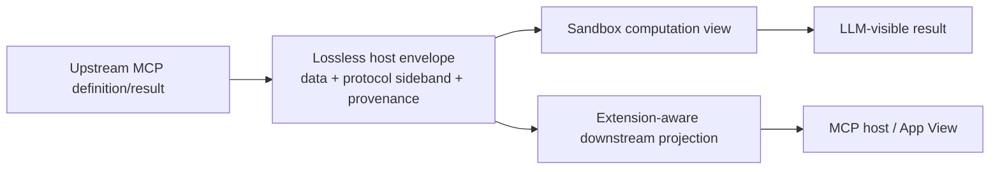

# MCP Extension Projection

**Status:** Deferred capability; v0.1 preservation boundary accepted  
**Date:** 2026-08-09

## Problem

The Code Mode server is both an MCP client of upstream servers and an MCP server for downstream LLM hosts. Hiding all upstream tools behind `run_typescript` changes protocol topology; it is not a transparent proxy.

MCP Apps makes the mismatch concrete. An upstream UI-enabled tool carries `_meta.ui` in its tool definition, points to a source-owned `ui://` resource, may expose app-only companion tools, and returns a complete `CallToolResult` to its View. A downstream host sees only the Code Mode server and its `run_typescript` tool unless the SDK deliberately projects those upstream concepts.

## Two planes

The computation plane gives sandboxed code the supported result data needed for orchestration. The protocol plane retains opaque metadata and provenance for an adapter that understands the corresponding extension. Copying opaque metadata into the computation result would both expose non-model data and still fail to implement the surrounding protocol behavior.

## Minimum architectural constraints

- Preserve unknown tool-definition and result `_meta` without interpreting or flattening it.
- Preserve the originating source and upstream tool identity.
- Keep protocol sideband outside model context by default.
- Do not expose app-only tools in the sandbox's model-facing tool catalog.
- Do not claim extension passthrough unless the downstream adapter implements the extension's capability, routing, resource, and visibility semantics.
- Namespace or rewrite source-scoped identifiers only in an extension-aware adapter that can reverse the mapping.

## MCP Apps requirements

A complete MCP Apps projection would need to address:

1. Downstream UI capability negotiation and how it affects already-managed upstream client connections.
2. Projection of upstream tool `_meta.ui.resourceUri` and `visibility` onto downstream tool definitions.
3. Collision-free rewriting of `ui://` resource URIs and proxying of `resources/read` to the correct upstream source.
4. Routing app-only tool calls back to the originating source without exposing those tools to the LLM.
5. Forwarding complete `CallToolResult` values, including `_meta`, to the View while controlling what enters model context.
6. Defining presentation semantics when one TypeScript execution invokes, combines, or transforms results from multiple UI-enabled tools.
7. Failure, caching, authorization, CSP, and teardown behavior across the additional proxy boundary.

## v0.1 decision

v0.1 retains opaque extension data and provenance but documents that `run_typescript` is a computation surface, not transparent MCP Apps passthrough. It does not rewrite UI resource identifiers, proxy resources or app calls, or advertise upstream UI definitions downstream. App-only upstream tools remain outside the model-facing catalog.

A later adapter can add projection without changing provider or sandbox contracts. Until then, retaining extension data is a compatibility property, not a promise that the extension functions through the Code Mode server.

This decision does not prohibit MCP Apps on the same downstream server. Consumer-owned tools can be registered directly as Apps because the consumer controls their tool definitions, resources, app-only calls, and lifecycle. If the same underlying capability is also exposed through a future `LocalToolProvider`, only its direct MCP registration renders the App; a nested sandbox invocation remains computation-only.

## Later projection shapes

### Add projected UI tools beside `run_typescript`

The downstream server re-exposes selected upstream UI tools and resources with rewritten identities. This can preserve MCP Apps semantics but increases the model-facing surface and requires extension-aware routing.

### Give `run_typescript` a generic multiplexing UI

One generic View interprets retained provenance and renders or delegates to an upstream UI. This preserves the small tool surface but introduces a substantial hosting, trust, capability, and composition design of its own.

## Executor reference

Executor's current design is useful precedent for separating computation from presentation, but it solves a narrower UI problem than transparent upstream projection:

- its MCP host registers first-party artifact tools against one Executor-owned MCP Apps shell and negotiates an embedded UI versus a deep link;
- its upstream MCP provider represents the complete `CallToolResult` shape and explicitly tests preservation of result `_meta`;
- its upstream tool manifest normalizes names, schemas, and selected annotations, but does not model arbitrary upstream tool-definition `_meta.ui`, UI resources, or app-call routing.

The reusable lesson is to retain rich result and provenance information in the core while letting a host surface negotiate delivery. CodeModeKit does not adopt Executor's persistent generative-artifact product scope in v0.1.

References at inspected commit `f674fb80eebd597f922edd5ec21b8035ab195a78`:

- [Executor artifact plan](https://github.com/UsefulSoftwareCo/executor/blob/f674fb80eebd597f922edd5ec21b8035ab195a78/plans/artifacts.md)
- [Executor MCP host artifact tools](https://github.com/UsefulSoftwareCo/executor/blob/f674fb80eebd597f922edd5ec21b8035ab195a78/packages/hosts/mcp/src/tool-server.ts)
- [Executor upstream MCP provider](https://github.com/UsefulSoftwareCo/executor/blob/f674fb80eebd597f922edd5ec21b8035ab195a78/packages/plugins/mcp/src/sdk/plugin.ts)
- [Executor MCP result-preservation test](https://github.com/UsefulSoftwareCo/executor/blob/f674fb80eebd597f922edd5ec21b8035ab195a78/packages/plugins/mcp/src/sdk/elicitation.test.ts)
